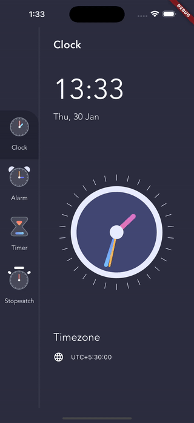

# Clock Custom Painter App

This Flutter project implements a custom clock using the `CustomPainter` class. The clock updates in real-time and provides a seamless user experience with Flutter's rich UI capabilities. The app also integrates `sqflite` for local database storage, `provider` for state management, and `flutter_local_notifications` to send notifications at specific times.

## Demo

## Features

- Custom clock painted using `CustomPainter`.
- Real-time updates to the clock.
- State management with `provider`.
- Smooth UI with real-time clock animation.
